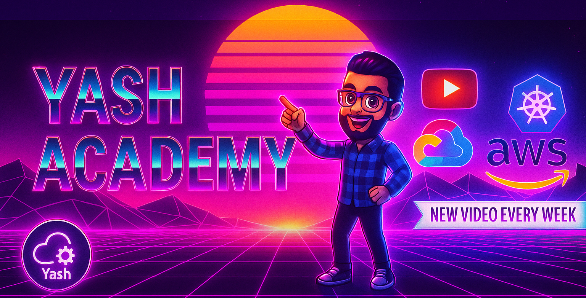

## Hi there 👋

<!-- Banner Image -->

  

<!-- Social Links -->

  
  
  
  
  

---

## 👋 Hey there!

### 👩‍💻 About Me
I'm **Arumulla Yaswanth Reddy**, passionate about building and automating modern cloud infrastructure.

- 🔭 Working on **Cloud & DevOps projects**
- 📚 Currently learning advanced **Kubernetes & AWS**
- ⚡ In my free time, I create projects, write on Medium, and mentor DevOps aspirants

---

## 🛠 Languages & Tools

  
  
  
  
  
  
  
  
  
  
  
  
  
  
  
  
  
  
  
  
  
  
  
  
  

---

## 🔥 My Stats

  

  

  

---

💬 _"Automating the future, one pipeline at a time."_

